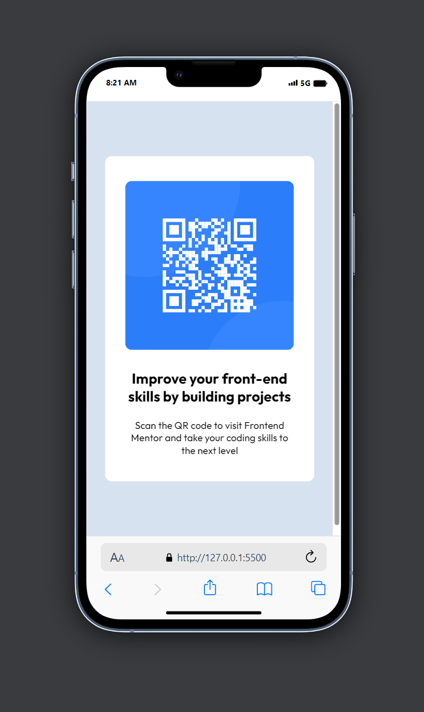
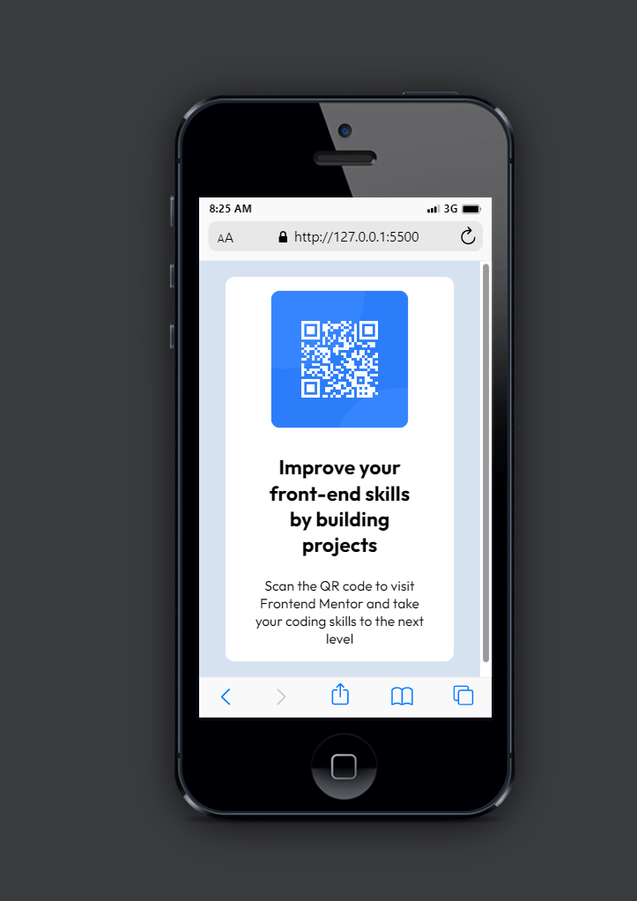
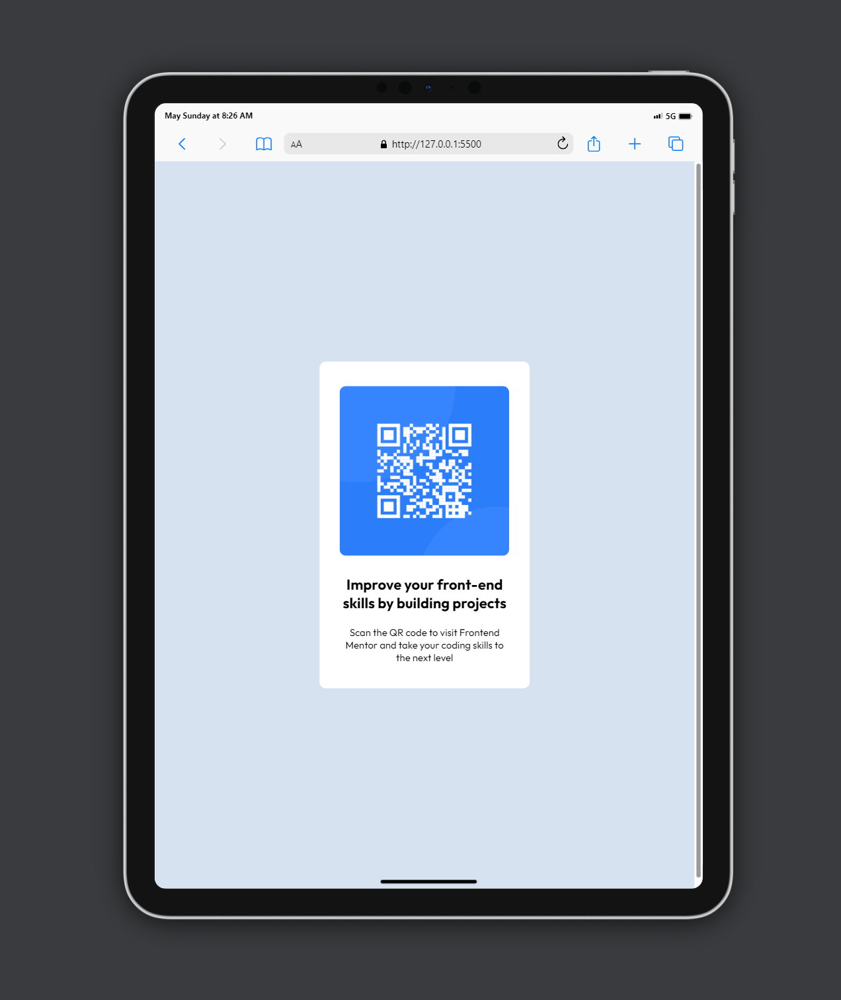

# Frontend Mentor - QR code component solution

This is a solution to the [QR code component challenge on Frontend Mentor](https://www.frontendmentor.io/challenges/qr-code-component-iux_sIO_H). Frontend Mentor challenges help you improve your coding skills by building realistic projects.

## Table of contents

- [Overview](#overview)
  - [Screenshot](#screenshot)
  - [Links](#links)
  - [Built with](#built-with)
  - [What I learned](#what-i-learned)
  - [Continued development](#continued-development)
- [Author](#author)
- [Acknowledgments](#acknowledgments)

**Note: Delete this note and update the table of contents based on what sections you keep.**

## Overview

### Screenshot

### Links

- Solution URL: [Link to the solution here](https://github.com/andychuks51/qr-code-component-main)
- Live Site URL: [Link to the Live site here](https://andychuks51.github.io/qr-code-component-main/)

### Built with

- Semantic HTML5 markup
- CSS custom properties
- Flexbox

### What I learned

Well I have a lot to learn, I though I could get this done in few minutes but it took me longer than I expected, I understood some fundamental ideas on responsive design and I hope to build on that with the next challenge.

### Continued development

I will continue to refine my coding skills, Yes I have a lot to learn and I'm willing to put my head down and understand the basics

## Author

- Frontend Mentor - [@andy.chuks51](https://www.frontendmentor.io/profile/andychuks51)
- Twitter - [@drew_techie](https://x.com/drew_techie?t=qz2ExB5xLsjnEIeHuc_7bA&s=09)

## Acknowledgments

First and foremost I give all thanks to God for giving me good health and also I want to thank my family for provide support for my development and speaking of development frontend mentors has also helped me to develop my skill so I say thanks to them as well.
